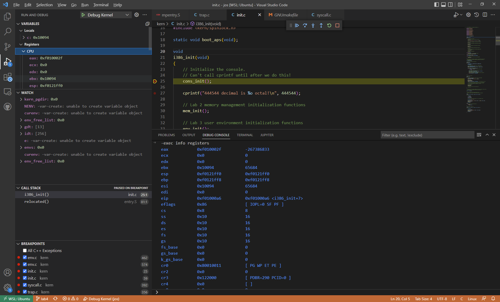
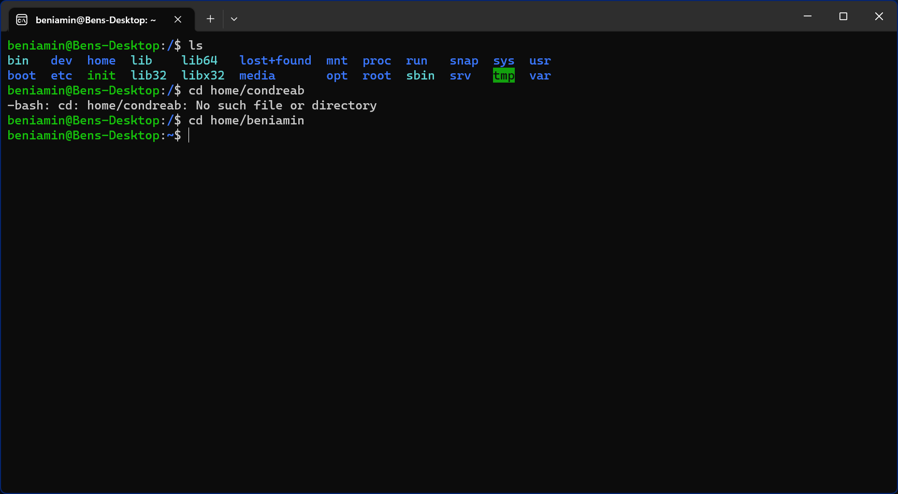

# Quick Guide: JOS Setting Up Local Debugging with Windows Subsystem for Linux, Visual Studio Code, QEMU, and GDB
**By Beniamin Condrea**

> NOTE: tested with **Ubuntu 22.04 LTS**



This is a step-by-step guide to setting up a local operating system debugging environment. This will be similar to the **Lab Setup** section on the website for an operating system class. It will include those steps as well, and some of those steps will be explicitly omitted. Setting up a Linux subsystem is useful, especially if you have other project (i.e. CUDA projects) which perform better on a Linux system.

> You should read the lab setup instructions carefully and fully *before* going through this guide. You first want a good general idea on how to set up the assignments. Do not skip on any class notes or readings, as this class is generally difficult.

The idea of this guide is to create a local environment to debug the kernel. This creates a nice interface for debugging the kernel. The major advantage is the portability of it being local and the debugging interface.

## Step 1: Windows Subsystem for Linux
WSL (Windows Subsystem for Linux) allows Windows to run a linux system.
> If you are interested in a more robust guide, here is the link: https://learn.microsoft.com/en-us/windows/wsl/install
1. Install a GNU/Linux distribution from the Microsoft Store (Ubuntu is the most common one)
2. In **PowerShell** or **Command Prompt**, run the follow command to install WSL:
   ```powershell
   wsl --install
   ```
   This command will enable the required optional components, download the latest linux kernel, set WSL 2 as the default, and install (Ubuntu as default).
   > The command above will only work if WSL is not installed. Trying running
   > `
   > wsl --list --online
   > `
   > to see a list of available distros and run
   > `
   > wsl --install -d <DistroName>
   > `
   > to install a distro.

   By Default, the installed Linux distribution will be Ubuntu. Change this with the `-d` flag:
   - Change Linux Distribution: `wsl --install -d <distibution Name>`
   - View list of Linux Distributions: `wsl --list --online`
   - Install additional distributions: `wsl --install -d <distibution Name>`

   > If you are in Linux/Bash command line, you can run the executable: `wsl.exe --install -d <Distribution Name>` or list the subsystems via `wsl.exe --list --online` (as shown below)


2. Restart the machine
3. Set up a linux username and password
     Access WSL by selecting **Start** then opening **Ubuntu** or any other distribution installed. Select **Ubuntu on Windows** then type in the username and password. This is specific for the Linux distribution and it has no effect on the Windows settings. Then run **sudo** commands (Super User Do)

4. Update and upgrade packages
    update and upgrade packages in Linux by running the command below:
    ```Bash
    sudo apt update && sudo apt upgrade
    ```
5. Install necessary programs for this class:
    - QEMU
    - Git
    ```Bash
    sudo apt-get install -y git && sudo apt-get install -y qemu && sudo apt-get install -y qemu-system-i386 && sudo apt-get install -y gcc-multilib
    ```
> Note: if you do not install **gcc-multilib**, you will get an error: `Undefined reference to '__divdi3'`

## Step 3: Setup Visual Studio Code for WSL
1. Install Visual Studio Code
2. Install VSCode extensions:
   - Remote - WSL
   - C/C++ (optional)
   - Git History (optional)
    > The **Remote Developer extension pack** allows running WSL, SSH, and a remote container for editing and debugging code with all the Visual Studio Code features.
3. Locate the home directory in Ubuntu, it should be located in `/home/<username>/`



4. Once in the directory, run the code command
```bash
code .
```

This command will open Visual Studio Code inside the current working directory.

> Running the `code` command requires the remote development extension pack for WSL.

This is the location to `git clone` for assignments in the *integrated terminal*.

```bash
git clone git@gitlab.enexploitable.systems:your-id/jos.git
cd jos
```

## Step 4: Setting Up Kernel Debugging

Now that the environment for work is properly set up, create tasks for JOS makefile. Because this is local, manually set gdb port to a number, perhaps `1234`. In the **GNUmakefile**:


## Step 5: Setting Up Tasks

Next, set up tasks for building the kernel, and also to launch the qemu.

In `.vscode/tasks.json`, first create a task to build the kernel using the `make` command:

```json
        {
            "type": "shell",
            "label": "Build kernel",
            "command": "make --directory=${workspaceFolder}",
            "args": [
            ],
            "options": {
                "cwd": "${workspaceFolder}"
            },
            "problemMatcher": [
                "$gcc"
            ],
            "group": {
                "kind": "build",
                "isDefault": true
            }
        },
```

Then create a qemu launch tasks with no graphics.

```json
{
            "type": "shell",
            "label": "Launch Qemu (no graphic)",
            "command": "make qemu-nox-gdb",
            "options": {
                "cwd": "${workspaceFolder}"
            },
            "dependsOn": "Build kernel",
            "isBackground": true,
            "problemMatcher": [
                {
                  "pattern": [
                    {
                      "regexp": ".",
                      "file": 1,
                      "location": 2,
                      "message": 3
                    }
                  ],
                  "background": {
                    "activeOnStart": true,
                    "beginsPattern": ".",
                    "endsPattern": "Now run 'gdb'",
                  }
                }
            ]

        }
```
Notice that it requires a **problem matcher** with an **end pattern** so that a task can start *after* the terminal pattern. The debug tasks will start after qemu has finished. Notice that the makefile runs a prompt "Now run 'gdb'". That is the pattern to match in the terminal.

> The terminal output can be changed for the problem matcher.


>  Optional: Add other launches from the makefile such as `make qemu-nox`, `print-qemu` etc.

## Step 6: Setting Up Lauches

After successfully seting up tasks, launch gdb for debugging. First, create a **prelaunch task** to first run (QEMU), then run gdb.

```json
{
            "name": "Debug Kernel",
            "type": "cppdbg",
            "request": "launch",
            "program": "${workspaceRoot}/obj/kern/kernel",
            "args": [],
            "stopAtEntry": false,
            "cwd": "${workspaceFolder}",
            "environment": [],
            "externalConsole": false,
            "MIMode": "gdb",
            "setupCommands": [
                {
                    "description": "Change back to the workspace folder",
                    "text": "cd ${workspaceRoot}",
                    "ignoreFailures": true
                },
                {
                    "description": "Enable pretty-printing for gdb",
                    "text": "-enable-pretty-printing",
                    "ignoreFailures": true
                }
            ],
            "preLaunchTask": "Launch Qemu (no graphic)",
            "miDebuggerPath": "/usr/bin/gdb",
            "miDebuggerArgs": "",
            "targetArchitecture": "x86_64",
            "customLaunchSetupCommands": [
                {
                    "text": "target remote localhost:1234",
                    "description": "Connect to QEMU remote debugger"
                },
                {
                    "text": "symbol-file obj/kern/kernel",
                    "description": "Get kernel symbols"
                },
                // {
                //     "text": "set architecture i8086",
                //     "description": "Sets the current architecture"
                // }
            ],
            "avoidWindowsConsoleRedirection": true
        }
```
## Step 7: Debugging the Kernel

Now start debugging. First, place a breakpoint in the code to start debugging:


Then start debugging by pressing **F5**.

Track variables while debugging:


Watch specific variables:


And even track the callstack:


Run commands in the **Debug Console** using `-exec <command>`. For example, below the command `-exec info registers` is run:


> Some sections of the kernel require running GDB commands for the labs!
- `Ctrl-c`\
    Halt the machine and break in to GDB at the current instruction. If QEMU has multiple virtual CPUs, this halts all of them.
- `c (or continue)`\
    Continue execution until the next breakpoint or Ctrl-c.
- `si (or stepi)`\
    Execute one machine instruction.
- `b function or b file:line (or breakpoint)`\
    Set a breakpoint at the given function or line.
- `b *addr (or breakpoint)`\
    Set a breakpoint at the EIP addr.
- `set print pretty`\
    Enable pretty-printing of arrays and structs.
- `info registers`\
    Print the general purpose registers, eip, eflags, and the segment selectors. For a much more thorough dump of the machine register state, see QEMU’s own info   registers command.
- `x/Nx addr`\
    Display a hex dump of N words starting at virtual address addr. If N is omitted, it defaults to 1. addr can be any expression.
- `x/Ni addr`\
    Display the N assembly instructions starting at addr. Using $eip as addr will display the instructions at the current instruction pointer.
- `symbol-file file`\
    (Lab 3+) Switch to symbol file file. When GDB attaches to QEMU, it has no notion of the process boundaries within the virtual machine, so we have to tell it which symbols to use. By default, we configure GDB to use the kernel symbol file, obj/kern/kernel. If the machine is running user code, say hello.c, you can switch to the hello symbol file using symbol-file obj/user/hello.
- `thread n`\
    GDB focuses on one thread (i.e., CPU) at a time. This command switches that focus to thread n, numbered from zero.
- `info threads`\\
    List all threads (i.e., CPUs), including their state (active or halted) and what function they’re in.

> QEMU represents each virtual CPU as a thread in GDB, so you can use all of GDB’s thread-related commands to view or manipulate QEMU’s virtual CPUs.
